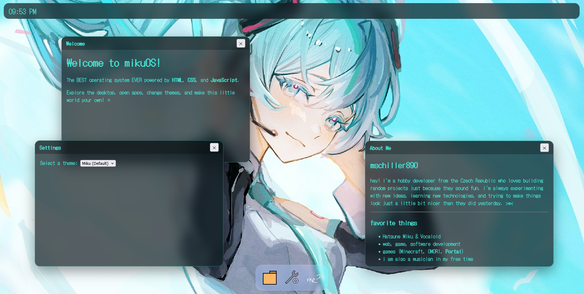

# webOS / mikuOS

> a tiny Hatsune Miku inspired web-based operating system made with love

hello everyone! >w<

welcome to **mikuOS**!

mikuOS is a small webOS project that tries to recreate the feeling of using a desktop operating system, but inside your browser.

---

# what is mikuOS?

mikuOS is not a real operating system (sadly 😔), but a web-based desktop environment with:

- draggable windows
- apps
- a dock
- themes/wallpapers (accent colors coming)
- animations
- a Miku inspired interface

everything runs directly in your browser using:

- HTML
- CSS
- JavaScript

no frameworks, no fancy engines, just pure web stuff!

---

# features

currently implemented (imagine a ding sound with each check):

✅ desktop environment  
✅ topbar with live clock  
✅ glass/blur UI effects  
✅ draggable windows  
✅ window opening and closing animations  
✅ app dock  
✅ settings app  
✅ about app  
✅ welcome screen  
✅ wallpaper themes  
✅ saves selected wallpaper using localStorage  

---

# themes

currently available wallpapers:

- Hatsune Miku (default)
- MEIKO

more themes are planned!

---

# apps

currently:

### Settings
change the current wallpaper/theme.

### About
a small introduction about the creator (me :D).

more apps will come later!

some ideas:

- file explorer (project explorer)
- terminal
- music player
- gallery
- widgets

---

# screenshots

---

# development

this project is being developed through small updates and devlogs.

the goal is not to make a perfect OS, but to slowly build a fun little world with:

- more apps
- more themes
- more animations
- more tiny details

---

# future plans

things i want to add:

- more Vocaloid themes
- better settings menu
- more apps
- notifications
- widgets
- better window management
- more animations
- maybe even sounds 👀

thanks for checking out mikuOS!

hope you enjoy this little project! >w<